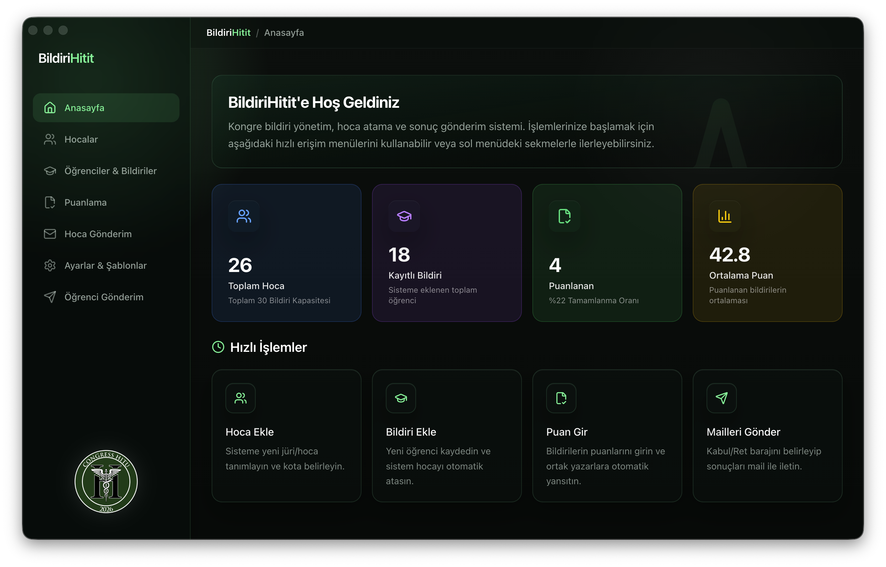

# BildiriHitit



BildiriHitit, kongre bildirilerinin toplanmasi, hakemlere dagitilmasi, puanlanmasi ve sonuc maillerinin gonderilmesi icin hazirlanmis Electron tabanli yonetim uygulamasidir. Uygulama tek pencere icinde dashboard, hoca yonetimi, ogrenci/bildiri kayitlari, puanlama ve mail akisini bir arada sunar.

## Baslica Ozellikler

- Hakem / hoca listesi tutma
- Hoca basi bildiri kapasitesi tanimlama
- Ogrenci ve bildiri kayitlarini olusturma
- DOCX dosyasi secme, kopyalama ve yerel dosya yonetimi
- Bildirilere puan girme ve ortalama takibi
- Hocalara ve ogrencilere toplu mail gonderimi
- SMTP baglanti testi
- PDF ve Excel disa aktarma

## Ekranlar

- `Anasayfa`
  Genel istatistikleri ve hizli islemleri gosterir.
- `Hocalar`
  Hakem kaydi, e-posta bilgisi ve kapasite yonetimi.
- `Ogrenciler & Bildiriler`
  Ogrenci, bildiri basligi, iletisim ve dosya yonetimi.
- `Puanlama`
  Bildiri puanlarinin girildigi ve takip edildigi alan.
- `Hoca Gonderim`
  Hakemlere bildiri gonderimi icin ayrilan alan.
- `Ayarlar & Sablonlar`
  Tema, SMTP ve e-posta sablonlari.
- `Ogrenci Gonderim`
  Kabul / ret benzeri sonuc gonderimleri.

## Gereksinimler

- Node.js 18+
- npm 9+
- SMTP erisimi olan bir e-posta hesabi

## Kurulum

```bash
npm install
```

## Gelistirme Modunda Calistirma

```bash
npm run dev
```

## Uretim Paketi Alma

```bash
npm run build
```

Mac DMG varyanti icin ayrica:

```bash
npm run build:electron:dmg
```

## Nasil Kullanilir?

1. Uygulamayi acin.
2. `Hocalar` ekranindan hakemleri ekleyin.
3. `Ogrenciler & Bildiriler` ekranindan bildirileri ve ogrenci kayitlarini girin veya ice alin.
4. Gerekirse bildiri dosyalarini sisteme baglayin.
5. `Puanlama` ekranindan degerlendirmeleri tamamlayin.
6. `Ayarlar & Sablonlar` ekraninda SMTP ve mail iceriklerini ayarlayin.
7. `Hoca Gonderim` veya `Ogrenci Gonderim` ekranindan toplu gonderimi baslatin.

## Veri Modeli Olarak Neler Tutulur?

Yerel olarak su veriler tutulur:

- Hoca listesi
- Ogrenci / bildiri kayitlari
- SMTP ayarlari
- Mail sablonlari
- Tema secimi

Bu sayede uygulama tekrar acildiginda son durum korunur.

## Mail Akisi

BildiriHitit, Nodemailer uzerinden SMTP ile gonderim yapar. Uygulamada:

- SMTP host
- Port
- Gonderici e-postasi
- Sifre
- Gonderici adi

bilgileri kaydedilebilir ve test edilebilir.

## Disa Aktarma

Uygulama asagidaki ciktilari destekler:

- Excel olarak bildiri listesi
- PDF olarak rapor / liste
- Gonderim loglari

## Script'ler

- `npm run dev` -> Gelistirme modu
- `npm run build` -> Uretim paketi
- `npm run build:electron:dmg` -> Mac icin DMG olusturma
- `npm run dev:vite` -> Sadece Vite
- `npm run dev:electron` -> Sadece Electron

## Dosya Yapisi

```text
BildiriHitit/
├── electron/
├── src/components/
├── src/theme.js
├── public/
└── package.json
```

## Notlar

- Uygulama merkezi bir web servise bagli degildir; is akisinin ana verisi yerel olarak tutulur.
- SMTP bilgileri olmadan toplu gonderim ekranlari kullanilamaz.
- Hakem kapasitesi ve puanlama mantigi kongre operasyonuna gore ozellestirilmistir.
