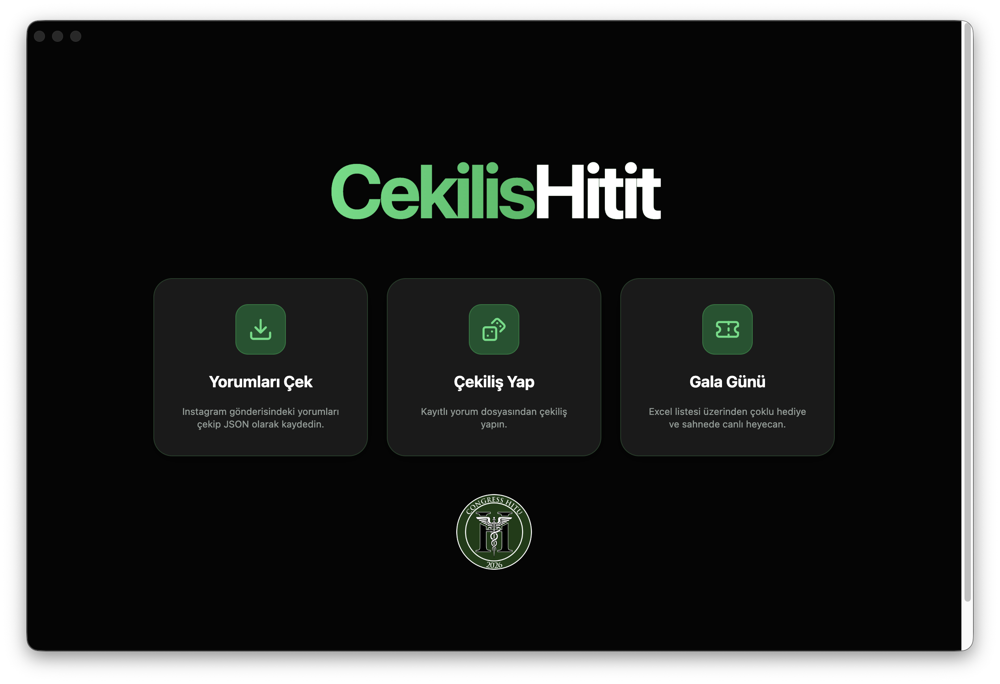

# CekilisHitit



CekilisHitit, hem Instagram çekiliş operasyonu hem de gala gecesi ödül dağıtımı için kullanılan Electron uygulamasıdır. Uygulama tek arayüzde yorum çekme, kurallı çekiliş yapma, çok turlu ödül dağıtımı ve sahneye uygun gala modu sunar.

## Çalışma Modları

### 1. Instagram Yorum Çekme

Bir Instagram gönderisinin yorumlarını indirir.

Desteklenen motorlar:

- `InstaTouch`
- `Apify Bulut`
- `Yerel (V6)`

### 2. Instagram Çekilişi

Yorumlar çekildikten sonra veya mevcut listeyle:

- kazanan sayısı
- yedek sayısı
- birden fazla kazanma kuralı
- takip etme / beğeni / etiket kontrolü
- çoklu ödül turları

gibi ayarlarla çekiliş yapar.

### 3. Gala Modu

Excel'den katılımcı ve ödül listesi yükleyerek sahnede çekiliş yapılmasını sağlar.

## Gereksinimler

- Node.js 18+
- npm 9+
- Instagram yorum çekimi için uygun erişim bilgisi

Motor bazlı ek gereksinimler:

- `Apify Bulut` için Apify API token
- `InstaTouch` için Instagram session id

## Kurulum

```bash
npm install
```

## Geliştirme Modunda Çalıştırma

```bash
npm run dev
```

## Üretim Paketi Alma

```bash
npm run build
```

## Instagram Yorum Çekme Nasıl Kullanılır?

1. Uygulamayı açın.
2. `Yorum Çekme` modunu seçin.
3. Instagram gönderi bağlantısını girin.
4. Kullanmak istediğiniz motoru seçin.
5. Gerekliyse Apify token veya session id bilgisini girin.
6. Yorumu çekip sonucu yerel liste olarak alın.

## Instagram Çekilişi Nasıl Yapılır?

1. `Çekiliş` modunu seçin.
2. Yorum listesini / çekiliş kaynağını belirleyin.
3. Her tur için ödül adı, kazanan ve yedek sayısını tanımlayın.
4. Tekrarlanan kazananları engellemek için tur mantığını kullanın.
5. Çekilişi başlatın.
6. Sonuç ekranında kazananları görüntüleyin.

## Gala Modu Nasıl Kullanılır?

1. `Gala` modunu seçin.
2. Katılımcı listesini Excel olarak yükleyin.
3. Ödül listesini Excel olarak yükleyin.
4. Dashboard ekranında ödül sırasını ve ayarları kontrol edin.
5. Manuel veya otomatik modda çekilişi başlatın.
6. Final ekranda tüm kazananları toplayın.

## Gala Excel Beklentileri

Katılımcı dosyası:

- İsim, soyisim, kurum gibi alanlar içerebilir
- Satırlar katılımcı olarak okunur

Ödül dosyası:

- `Ödül` / `Prize`
- `Adet` / `Count`

alanlarını destekler.

## Script'ler

- `npm run dev` -> Geliştirme modu
- `npm run build` -> Üretim paketi
- `npm run lint` -> ESLint kontrolü
- `npm run preview` -> Vite önizleme

## Diğer Dosyalar

Repo içinde şu yardımcı dosyalar bulunur:

- `scraper/` -> Python tabanlı scraping denemeleri
- `ig-test/` -> Test amaçlı dosyalar
- `apify_schema.json` -> Apify akışına dair şema

## Notlar

- Yerel scraping yöntemleri Instagram tarafında risk oluşturabilir.
- Apify kullanımı daha güvenli bir akıştır ancak harici servis bağımlılığı vardır.
- Gala modu, sahne akışına uygun hızlı operasyona göre tasarlanmıştır.
