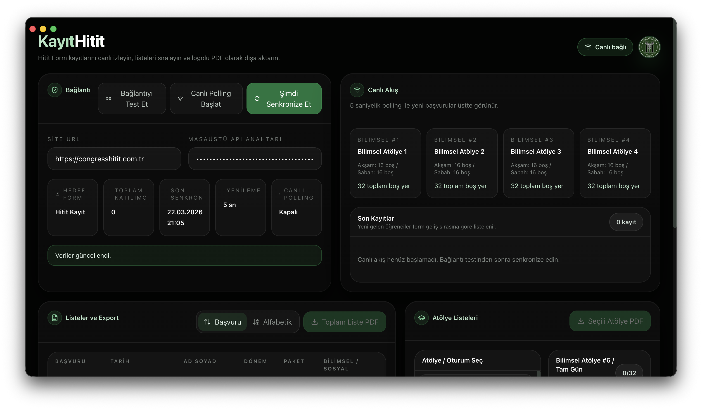

# KayitHitit



KayitHitit, kongre kayitlarini WordPress uzerinden canli takip etmek icin gelistirilmis Electron masaustu panelidir. Katilimcilari listeler, canli akis uzerinden yeni kayitlari gosterir, atolye doluluklarini takip eder ve secilen listeleri PDF olarak disa aktarir.

## Ne Ise Yarar?

- WordPress'teki kayitlari tek ekranda toplar
- Yeni gelen basvurulari canli polling ile izler
- Bilimsel ve sosyal atolyeleri ayri ayri listeler
- Katilimci listesini veya secili atolye listesini PDF ciktisi olarak olusturur
- Basvuru numarasina gore veya farkli siralama tiplerine gore veri goruntuler

## Bagimli Oldugu Bilesen

Bu uygulama tek basina calismaz. Veri kaynagi olarak su eklentiye baglanir:

- [KayitPlugin](../Wordpress/Plugins/KayitPlugin)

KayitPlugin de kendi icinde [FormHitit](../Wordpress/Plugins/FormHitit) ile entegre calisir.

## Gereksinimler

- Node.js 18+
- npm 9+
- Calisan bir WordPress sitesi
- Etkin `Kongre Atolye Yerlestirme` eklentisi
- WordPress tarafinda olusturulmus masaustu API anahtari

## Kurulum

```bash
npm install
```

## Gelistirme Modunda Calistirma

```bash
npm run dev
```

Bu komut:

- Vite gelistirme sunucusunu baslatir
- Electron penceresini acar

## Uretim Paketi Alma

```bash
npm run build
```

Olusan masaustu paketleri `dist-app/` altina yazilir.

## Uygulama Icinde Ilk Kurulum

Uygulama acildiginda sizden iki temel bilgi ister:

1. `Site Adresi`
   Ornek: `https://siteadresiniz.com`
2. `Masaustu API Anahtari`
   Ornek: `kh_...`

Bu bilgiler, WordPress tarafindaki `kongre-desktop/v1` endpoint'lerine baglanmak icin kullanilir.

## Nasil Kullanilir?

1. WordPress tarafinda hedef formu ve masaustu API ayarlarini hazirlayin.
2. KayitHitit uygulamasini acin.
3. Site adresini ve API anahtarini girin.
4. `Baglanti Testi` yapin.
5. Basariliysa dashboard verilerini cekin.
6. Istiyorsaniz canli polling'i aktif edip yeni kayitlarin anlik dusmesini izleyin.
7. Katilimci veya atolye listesi secip PDF export alin.

## Uygulamanin Gosterdigi Veriler

- Toplam katilimci sayisi
- Son senkronizasyon zamani
- Canli akisa dusen son kayitlar
- Tum katilimci listesi
- Bilimsel ve sosyal atolye oturumlari
- Secili oturuma ait ogrenci listesi

## PDF Ciktilari

Uygulama iki farkli PDF uretebilir:

- Toplam katilimci listesi
- Secili atolye / oturum listesi

PDF ciktilari kongre logosu ve duzenli tablo bicimi ile olusturulur.

## WordPress Tarafinda Gerekli API'ler

KayitHitit su endpoint'lerle haberlesir:

- `/wp-json/kongre-desktop/v1/bootstrap`
- `/wp-json/kongre-desktop/v1/live`
- `/wp-json/kongre-desktop/v1/participants`
- `/wp-json/kongre-desktop/v1/workshops`

Yetkilendirme `X-Hitit-Desktop-Key` header'i ile yapilir.

## Script'ler

- `npm run dev` -> Vite + Electron gelistirme modu
- `npm run build` -> Web bundle + Electron paketleme
- `npm run dev:vite` -> Sadece Vite
- `npm run dev:electron` -> Sadece Electron

## Dosya Yapisi

```text
KayitHitit/
├── electron/
├── src/
├── public/
├── electron-icons/
└── package.json
```

## Notlar

- Ayarlar yerel olarak saklanir.
- API anahtari olmadan uygulama veri cekmez.
- Bu arac, operasyon ekranidir; esas veri yonetimi WordPress tarafindadir.
