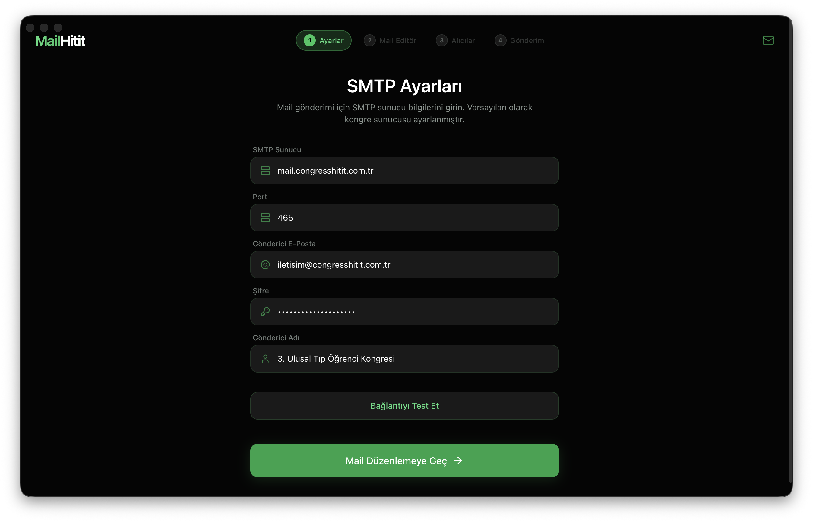

# MailHitit



Excel listeleri üzerinden toplu ve kişiselleştirilmiş e-posta gönderim aracı.

## Özellikler
- **Excel Desteği**: Sütun eşleştirme yöntemiyle her türlü listeyi içe aktarma.
- **Kişiselleştirme**: `{{ad_soyad}}` gibi etiketlerle dinamik içerik oluşturma.
- **SMTP Yapılandırması**: Kendi e-posta sunucunuzu (Gmail, Outlook veya Özel) tanımlama.
- **Gönderim Raporu**: Başarılı ve başarısız gönderimleri anlık izleme.

## Kurulum
```bash
npm install
npm run dev
```
