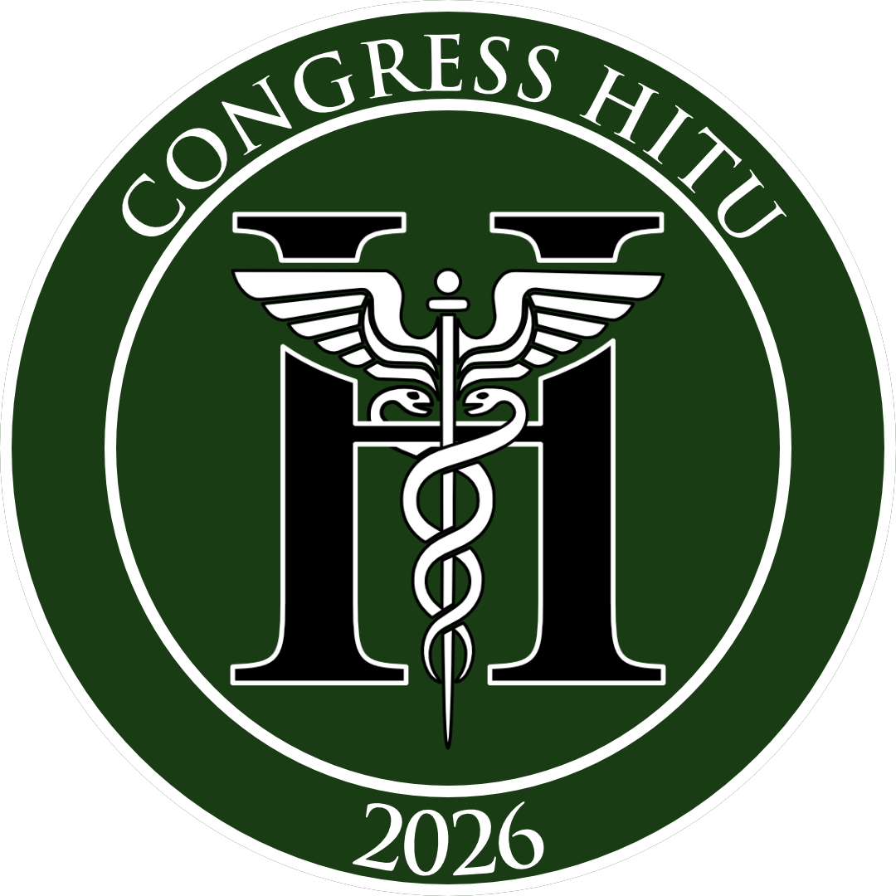

# CongressHitit'26

<p align="center">
  
</p>

Bu depo, 3. Ulusal Tıp Öğrenci Kongresi için geliştirdiğim masaüstü uygulamalarını, bu uygulamaların bağlandığı WordPress eklentilerini ve kongre temasını tek yerde toplar. Projedeki klasörler birbirinden bağımsız çalışabilir; ancak en verimli kullanım şekli WordPress tarafı ile masaüstü araçlarını birlikte kullanmaktır.

## Depoda Neler Var?

### Masaüstü uygulamaları

1. [KayitHitit](./KayitHitit)
Kongre kayıtlarını canlı izler, atölyeleri listeler, filtreler ve PDF çıktısı alır.

2. [BildiriHitit](./BildiriHitit)
Bildiri, hakem, puanlama ve sonuç maili süreçlerini yönetir.

3. [MailHitit](./MailHitit)
Excel listeleri üzerinden kişiselleştirilmiş toplu e-posta gönderir.

4. [CekilisHitit](./CekilisHitit)
Instagram yorum çekimi, çekiliş yönetimi ve gala gecesi ödül akışını yönetir.

### WordPress içerikleri

5. [Wordpress](./Wordpress)
Kongre sitesinde kullanılan özel plugin'ler, tema ve hazır zip paketlerini içerir.

## Önerilen Kullanım Sırası

1. WordPress tarafında [TemaHitit](./Wordpress/Themes/TemaHitit) temasını ve ihtiyaç duyulan plugin'leri kurun.
2. Form ve kayıt akışı için [FormHitit](./Wordpress/Plugins/FormHitit) ile [KayitPlugin](./Wordpress/Plugins/KayitPlugin) eklentilerini etkinleştirin.
3. Kayıt takibi gerekiyorsa [KayitHitit](./KayitHitit) uygulamasında WordPress site adresi ve masaüstü API anahtarını tanımlayın.
4. Bildiri sürecini yönetmek için [BildiriHitit](./BildiriHitit) uygulamasında hoca, öğrenci ve SMTP ayarlarını oluşturun.
5. Toplu bilgilendirme ihtiyaçlarında [MailHitit](./MailHitit) ile Excel tabanlı mail gönderimleri yapın.
6. Sosyal medya çekilişi veya gala çekilişi için [CekilisHitit](./CekilisHitit) uygulamasını kullanın.

## Genel Gereksinimler

- Node.js 18+
- npm 9+
- Electron uygulamaları için masaüstü ortam
- WordPress 6+
- PHP 8.0+ ve MySQL/MariaDB

## Masaüstü Uygulamalarını Çalıştırma

Her uygulama kendi klasörü içinde bağımsız bir React + Electron projesidir.

```bash
cd KayitHitit
npm install
npm run dev
```

Üretim paketi almak için:

```bash
npm run build
```

Ayrı ayrı uygulama klasörleri:

- `KayitHitit`
- `BildiriHitit`
- `MailHitit`
- `CekilisHitit`

## WordPress Tarafını Kurma

WordPress bileşenleri iki farklı şekilde kullanılabilir:

- Kaynak koddan: `Wordpress/Plugins/*` ve `Wordpress/Themes/TemaHitit`
- Hazır paketlerden: `Wordpress/Zips`

Standart kurulum:

1. Plugin klasörlerini `wp-content/plugins/` altına kopyalayın.
2. Tema klasörünü `wp-content/themes/` altına kopyalayın.
3. WordPress panelinden ilgili tema ve eklentileri etkinleştirin.

## Klasör Yapısı

```text
.
├── KayitHitit/
├── BildiriHitit/
├── MailHitit/
├── CekilisHitit/
├── Wordpress/
│   ├── Plugins/
│   ├── Themes/
│   └── Zips/
└── assets/
```

## Hangi Bileşen Ne ile Entegre?

- `KayitHitit` -> `Wordpress/Plugins/KayitPlugin`
- `KayitPlugin` -> `Wordpress/Plugins/FormHitit`
- `BildiriHitit` -> Yerel veri + SMTP + dosya yönetimi
- `MailHitit` -> Yerel Excel dosyaları + SMTP
- `CheckPlugin` -> Google Sheets tabanlı kayıt sorgulama
- `TemaHitit` -> Kongre sayfaları, özel şablonlar ve Gutenberg pattern'leri

## Notlar

- Masaüstü uygulamaları ayarlarını yerel olarak saklar.
- WordPress plugin'leri kongreye özel alan adları ve iş akışlarına göre yazılmıştır.
- Hazır zip dosyaları, canlı sunucuya hızlı kurulum yapabilmek için repoda tutulur.
