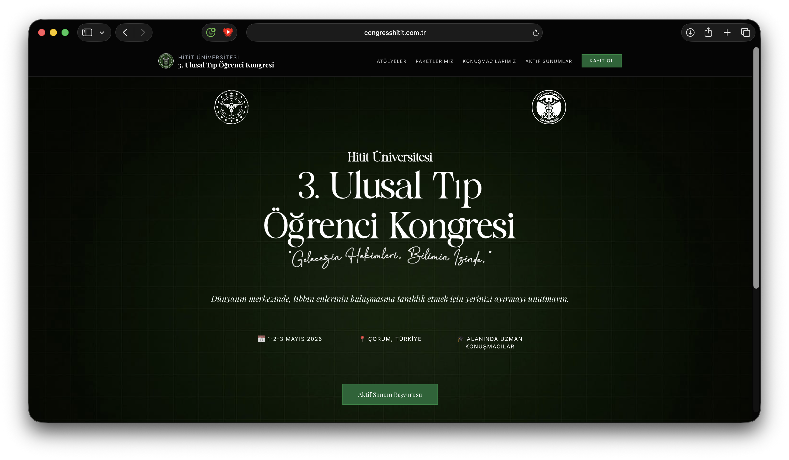

# TemaHitit



TemaHitit, 3. Ulusal Tip Ogrenci Kongresi sitesi icin gelistirilmis ozel WordPress temasidir. Tema; Gutenberg uyumu, ozel sayfa sablonlari, block pattern'leri ve Tailwind tabanli stil yapisi ile kongre iceriklerinin hizli yonetilmesini saglar.

## Temanin Sundugu Yapi

- Responsive kongre sitesi tasarimi
- Gutenberg destekli duzenleme akisi
- Ozel sayfa sablonlari
- Ozel pattern'ler
- Yerel font ve Font Awesome varliklari
- Tailwind ile derlenen stil sistemi

## Destekledigi Alanlar

Tema kurulumunda su WordPress ozellikleri etkinlestirilir:

- `title-tag`
- `post-thumbnails`
- HTML5 bilesenleri
- `wp-block-styles`
- `align-wide`
- `editor-styles`
- `responsive-embeds`
- `custom-logo`

## Menu Konumlari

- `primary`
- `mobile`
- `footer`

## Ozel Sayfa Sablonlari ve Dosyalar

Temada kongreye ozel hazir sayfalar bulunur:

- `front-page.php`
- `page-paketlerimiz.php`
- `page-odeme-bilgileri.php`
- `page-program-atlasi.php`
- `page-ekibimiz.php`
- `template-full-width.php`
- `template-blank.php`

## Pattern'ler

Gutenberg tarafinda tekrar kullanilabilen pattern dosyalari:

- `hero`
- `program`
- `social-program`
- `presentations`
- `speakers`
- `gala`
- `workshops`
- `team`
- `registration`

## Kurulum

1. Bu klasoru `wp-content/themes/` altina kopyalayin.
2. WordPress panelinden temayi etkinlestirin.
3. Menu konumlarini baglayin.
4. Logo, ana sayfa ve sayfa iceriklerini duzenleyin.

Alternatif olarak `Wordpress/Zips/hitit-tema-v2.8.9.zip` paketini kullanabilirsiniz.

## Gelistirme

Tema Tailwind CSS ile stil uretiyor.

Kurulum:

```bash
npm install
```

Izleme modu:

```bash
npm run watch:css
```

Minify build:

```bash
npm run build:css
```

## Tema Icindeki Diger Ozel Bilesenler

Tema klasoru icinde kongreye ozel gomulu plugin varyantlari da bulunur:

- `form-plugin/`
- `reg-check-plugin/`

Ana gelistirme kaynagi olarak yine `Wordpress/Plugins/` altindaki klasorleri esas almak daha duzenlidir; ancak tema icindeki kopyalar dagitim ve tasima kolayligi saglayabilir.

## Dosya Yapisi

```text
TemaHitit/
├── assets/
├── patterns/
├── template-parts/
├── form-plugin/
├── reg-check-plugin/
├── functions.php
├── style.css
└── theme.json
```

## Notlar

- Tema, kongre sayfalarini hizli yayina almak icin bircok varsayilan icerik ve sablon sunar.
- `functions.php` icinde paketler, odeme bilgileri ve program atlasi gibi ozel varsayilan icerikler uretilir.
